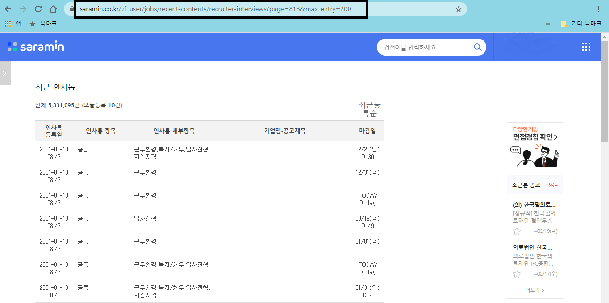

# 사람인 최근 인사통 검색 도우미

- 사람인 최근 인사통을 통해 기업에 지원한 사람이 어떤 사람이 어떤 분야에 지원했는지 확인하기 위한 툴  
  - 경쟁자 스펙들이 좀 쟁쟁하다 싶으면 빠르게 손절하고 다른 기업에 지원하려는 용도로 사용
- URL에 직접 페이지 번호와 페이지당 표시 데이터를 입력하는 것이 귀찮아서 제작함  

  
**주의**  
최근 인사통에서 원하는 기업을 못 찾을 수도 있음



## 설명

윈도우에서 구동되며, 파이어폭스으로 조작하기 때문에 파이어폭스을 설치해야한다.  
의존 라이브러리를 CMD창을 열고 설치한다

```bash
pip install pyside
pip install pywin32
```

실행은 main.py를 실행하면 됨

```bash
python main.py 
```
