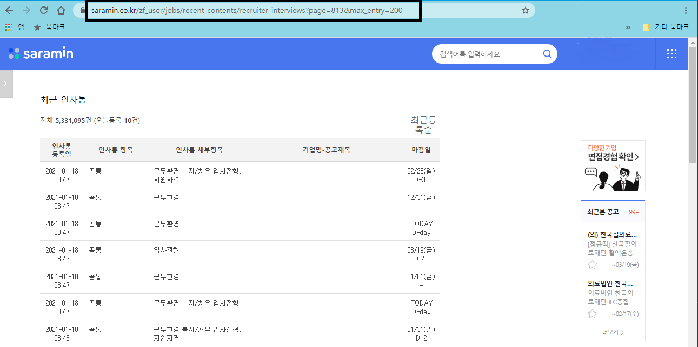
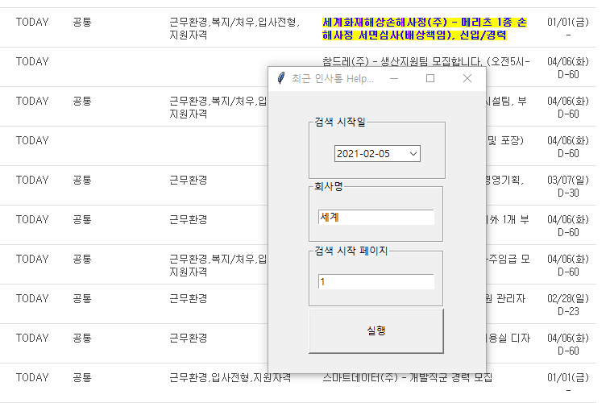

# 사람인 최근 인사통 탐색기

2022-04-29일 기준 사람인 인사통 페이지가 사라졌으므로 프로그램이 의미가 없어짐 업데이트 중지함

사람인에서 공고에 지원한 지원자의 연령, 경력, 학력은 알 수 있지만,  
세밀하게 지원자가 지원 분야에 지원했고, 지원자의 희망연봉, 전공, 경력, 자격증 갯수등을 알려면 최근 인사통에서만 알 수 있다.  

다만 최근 인사통은 기업명을 검색할 수 없고, 페이지 버튼을 눌러가면서 찾아야 하는데, 공고의 시작일까지 찾아서 가려면, 직접 브라우저 URL에 페이지 번호(page)를 수작업으로 입력해야되는 번거로움이 있다.  
  
이에 URL에 직접 페이지 번호와 페이지당 표시 데이터를 입력하는 것이 귀찮아서 제작하였고,  
스펙 좋은 사람들이나 내가 지원한 분야에 경쟁자들이 쟁쟁하거나 경쟁률이 높은 경우 정보를 얻고 빠른 손절을 위해서 제작함.  
  
**주의**  
최근 인사통에서 원하는 기업을 못 찾을 수도 있다.  
최근 인사통에 공고시작일자에 맞춰서 탐색을 해도 표시되지 않는 기업이 있다. - (표시되는 조건을 모르겠다 ㅎ)  

## 설명

파이썬으로 구현되었기 때문에 python 3.x 이상 버전을 설치되어 있어야한다.
  
윈도우에서 구동되며, 크롬으로 조작하기 때문에 크롬을 설치해야한다.  
크롬을 selenium일 이용해서 제어해야 되기 때문에 크롬 버전(88, 89..등)에 맞춰서,  
크롬드라이버 다운로드 후 압축을 풀어서 driver 폴더에 저장한다 (프로젝트에 있는 것은 90버전).  
의존 라이브러리를 CMD창을 열고 설치한다  
  
**설치**는 setup.bat를 더블클릭해서 실행한다.  
pip를 이용해서 의존 라이브러리를 자동으로 설치한다.  
  
**실행**은 main.bat을 더블클릭 해서 실행한다.  
  
GUI는 다음과 같이 간단하게 구성되어있다.  
  

- 검색시작일 : 인사통 검색 시작 날짜를 입력한다.
- 회사명 : 검색할 회사명을 입력한다.
- 검색 시작 페이지 : 검색 시작을 할 기준 페이지를 입력한다  
- 실행버튼 : 인사통 자동 검색을 실행한다.
